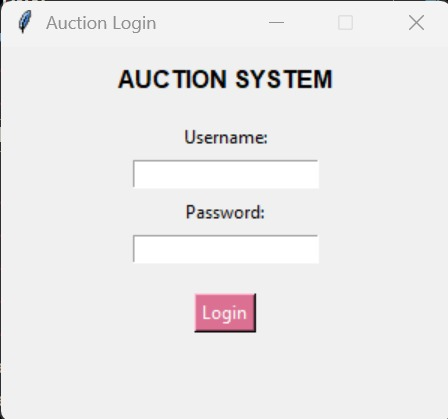
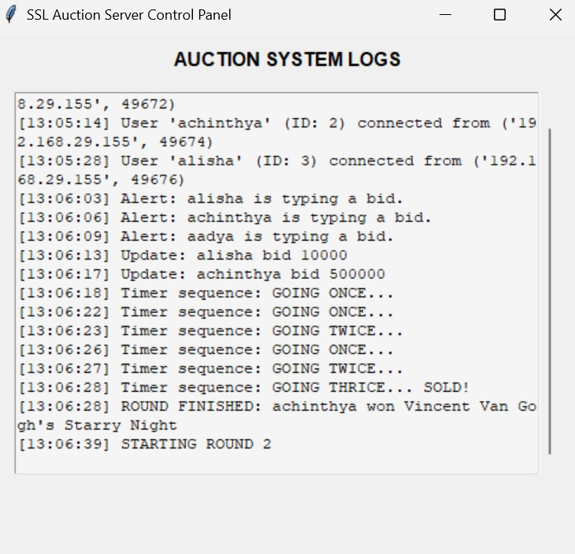
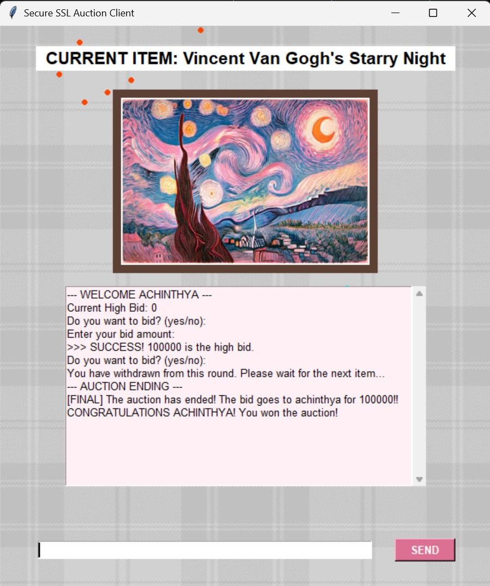
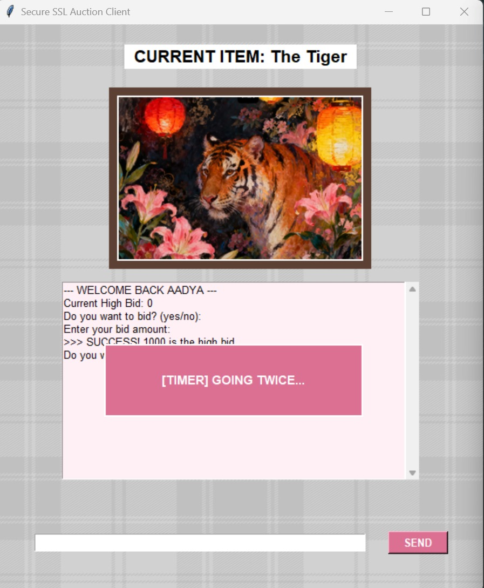

# Online-Auction-Bidding-Engine

### Secure SSL-Encrypted Multithreaded Application

-----

##  Team Information

  * Aadya Santhosh -- PES1UG24CS005
  * Achinthya MB -- PES1UG24CS019
  * Alisha Kulshrestha -- PES1UG24CS049
-----

##  Project Overview

The Online Auction Bidding Engine is a high-concurrency distributed system designed to simulate a secure, real-time auction house environment. Built entirely in Python, the project addresses the critical challenges of data integrity and synchronized state management in a network-based application.

The core of the project revolves around two primary scripts:

1.  *server.py*: A robust backend that manages the auction lifecycle, handles multithreaded client connections, and enforces strict authentication via a CSV-based database.
2.  *client.py*: A feature-rich Graphical User Interface (GUI) that provides users with a seamless bidding experience, live item previews, and real-time alerts.

By implementing SSL/TLS encryption (using server.crt and server.key), the system ensures that sensitive bidding data and user credentials remain confidential, protecting against packet sniffing and MITM (Man-in-the-Middle) attacks.

-----

##  Demo Screenshots

### Login Page

\
Validates user credentials against the users.csv database over a secure SSL handshake before granting access to the auction floor.\

### Server Side Gui

\
Provides the administrator with a real-time monitoring dashboard that logs every connection, bid attempt, and timer sequence in the system.\

### User Gui

\
Features a high-resolution bidding interface that dynamically renders auction items and live chat logs using the Tkinter and Pillow libraries.\

### Timer

\
Implements a synchronized threading.Event logic that manages the "Going Once, Going Twice" countdown, resetting automatically upon every valid higher bid.\

### Pop Up Alerts

\
Delivers instantaneous, non-blocking visual notifications for critical events like high bid updates, bidder withdrawals, and upcoming round preparations.\

### Winner Side Fireworks

https://github.com/user-attachments/assets/81d7e477-38a7-43ca-a4ab-0f2a89852adf 

Executes a dynamic canvas particle animation to provide immediate visual celebration for the user who successfully secures the highest bid.\

-----

##  Technical Deep Dive

### 1. Security Framework

The application uses the ssl module to wrap standard TCP sockets.

  * Encryption: Uses RSA-4096 bit encryption for the transport layer.
  * Authentication: The *authenticate_user* function in server.py performs a lookup against users.csv. If a user is not found, the initialize_user_db function provides a failsafe by generating a default credential set (e.g., user1, pass1).

### 2. Concurrency & Synchronization

To handle multiple bidders simultaneously, the server utilizes:

  * threading: Each client is isolated in a unique thread to prevent a single slow connection from lagging the entire auction.
  * threading.Lock(): Crucial for the highest_bid variable, ensuring that two bids arriving at the exact same millisecond do not corrupt the auction state.
  * timer_reset_event: A threading.Event that manages the countdown logic. Every time a new bid is placed, the "Going Once, Going Twice" timer is reset, exactly like a real-world auction.

### **3. Dynamic Frontend Logic**

The client.py script leverages tkinter and PIL (Pillow) to:

  * Render high-quality backgrounds (background1.jpg).
  * Display item catalogs (painting.jpg through painting5.png) as instructed by the server’s SET_ITEM signals.
  * Execute a trigger_fireworks particle system on the Canvas whenever the user wins an auction round.

-----

##  How to Execute

1.  Install Dependencies:
    ```bash
    pip install Pillow
    ```
2.  Launch the Server:
    ```bash
    python server.py
    ```
3.  Launch Bidders: Open multiple terminals and run:
    ```bash
    python client.py
    ```

-----

##  Conclusion

The Online Auction Bidding Engine successfully demonstrates the integration of secure networking and real-time state synchronization. By utilizing a Multithreaded Server architecture, the system maintains high availability and responsiveness even under the load of multiple concurrent bidders.

The implementation of SSL/TLS wrapping ensures that the project isn't just a functional simulation, but a security-conscious application that adheres to modern networking standards. The automated Timer Reset mechanism and CSV-based persistence provide a realistic auction experience, while the Tkinter GUI ensures accessibility for the end-user. Ultimately, this project serves as a comprehensive exploration of how encrypted sockets, thread safety, and event-driven programming can be combined to build a reliable distributed engine.
